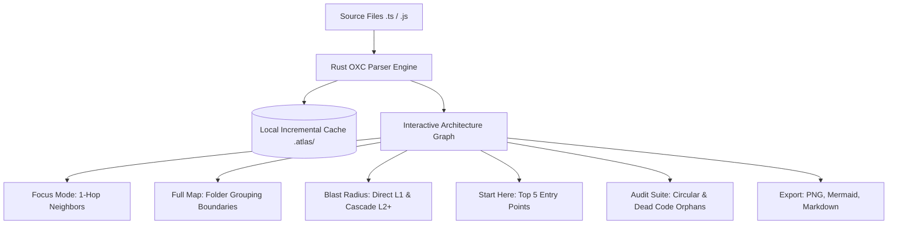

# Atlas — Codebase Map

> **Interactive Architecture Visualizer, Start Here Onboarding, and Reverse Blast Radius Analyzer**

[](https://marketplace.visualstudio.com/items?itemName=wealthypeople.atlas-map)
[](https://code.visualstudio.com/)
[](https://opensource.org/licenses/MIT)
[](#privacy-and-security-specification)
[-orange.svg)](#privacy-and-security-specification)

**Never feel lost in a codebase again.**  
Atlas transforms any TypeScript or JavaScript repository into an interactive architecture map directly inside your VS Code sidebar or editor tab. Zero configuration, zero external servers, zero code uploads.

[Quick Start](#quick-start-guide) | [Core Workflows](#core-developer-workflows) | [Key Capabilities](#key-capabilities) | [Architecture Layers](#architectural-layer-classification) | [Commands & Shortcuts](#commands-and-keyboard-shortcuts) | [Configuration](#workspace-configuration)

---

## Architecture & Visual Overview



---

## Quick Start Guide

Getting started with Atlas requires no initial configuration:

```text
1. Open any TypeScript or JavaScript project in VS Code.
2. Click the Atlas icon in the left Activity Bar (or press Ctrl+Shift+P -> "Atlas: Open Architecture Map").
3. Atlas automatically indexes imports locally in milliseconds and opens your interactive map.
```

---

## Core Developer Workflows

### 1. Codebase Onboarding in Minutes
- **Challenge:** Navigating an unfamiliar repository with hundreds of files and unclear execution entry points.
- **Solution:** The **Start Here** recommendation bar automatically scores and highlights the top 5 architectural entry points using fan-in metrics, dependency centrality, and line count weighting. Click any recommendation to open the source file immediately.

### 2. Impact-Aware Refactoring (Reverse Blast Radius)
- **Challenge:** Modifying shared services, utilities, or data models without knowing which downstream components will break.
- **Solution:** Press **`Ctrl + Shift + I`** on any active file. Atlas performs reverse breadth-first traversal to display the complete downstream impact tree:
  - **Direct Consumers (L1):** Bold Crimson lines indicate modules that directly import the selected file.
  - **Downstream Cascade (L2+):** Thin Amber Gold lines trace indirect downstream consumers.
  - **Risk Assessment:** The bottom drawer summarizes computed impact severity (Low, Medium, High, Critical) with actionable plain-language diagnostics.

### 3. Pre-PR Working Tree Sanity Check
- **Challenge:** Verifying that a batch of uncommitted modifications across multiple folders does not introduce unintended architectural ripple effects.
- **Solution:** Open the **Git Impact** modal to view the unified blast radius generated across all modified files in your current working branch before submitting a pull request.

### 4. Technical Debt and Code Quality Auditing
- **Circular Dependencies:** Detect and inspect cyclic import loops using Tarjan's Strongly Connected Components algorithm.
- **Dead Code and Orphans:** Identify isolated source files with zero internal consumers to streamline dead code removal.

---

## Key Capabilities

| Capability | Technical Details |
| :--- | :--- |
| **Interactive Graph Canvas** | Hardware-accelerated canvas with smooth panning, zooming, physics-based clustering, and double-click editor navigation. |
| **Folder Grouping** | Boundary box clustering (`Group by Folder`) to visualize directory structures such as `frontend`, `backend`, and modular packages side-by-side. |
| **View Modes** | **Focus Mode** (1-hop isolated neighborhood), **Full Map** (complete repository topology), and **Blast Radius** (downstream consumer tree). |
| **Spotlight File Search** | Fast fuzzy search via **`/`** or **`Ctrl + K`** with early-exit indexing across all repository paths. |
| **History Navigation** | Browser-grade history stack enabling **`Alt + Left`** and **`Alt + Right`** traversal between inspected nodes. |
| **Multi-Format Export** | High-resolution PNG image generation, Mermaid diagram syntax copying for GitHub pull requests, and comprehensive Markdown Architecture Audit reports. |
| **Monorepo Architecture** | Native path resolution for multi-root projects, nested `tsconfig.json` / `jsconfig.json` aliases (`@/*`), and package `_moduleAliases`. |
| **Ultra-Low Resource Footprint** | RequestAnimationFrame event coalescing, background tab suspension (0% idle CPU usage), and zero-allocation static memory management. |

---

## Architectural Layer Classification

Atlas categorizes source files into 5 distinct architectural tiers:

| Layer | Accent Color | Description and Common Directories |
| :--- | :---: | :--- |
| **UI & Views** | Purple (`#c084fc`) | Presentation layer: React components, pages, views, layouts, `.tsx`, `.jsx` |
| **Services & APIs** | Cyan (`#22d3ee`) | Business logic layer: API routes, controllers, services, handlers |
| **Data & Models** | Amber (`#fbbf24`) | Persistence layer: database schemas, ORM models, Prisma clients, migrations |
| **Utilities** | Emerald (`#34d399`) | Shared utilities: helper functions, library wrappers, mathematical tools |
| **Config** | Slate (`#94a3b8`) | Environment definitions: build configurations, constants, runtime settings |

---

## Commands and Keyboard Shortcuts

| Command | Shortcut (Windows / Linux) | Shortcut (macOS) | Description |
| :--- | :---: | :---: | :--- |
| **Show Blast Radius of Current File** | `Ctrl + Shift + I` | `Cmd + Shift + I` | Opens Blast Radius impact map for active file |
| **Quick Spotlight Search** | `/` or `Ctrl + K` | `/` or `Cmd + K` | Opens fuzzy search modal across workspace |
| **History Navigation Back** | `Alt + Left` | `Opt + Left` | Return to previously inspected file node |
| **History Navigation Forward** | `Alt + Right` | `Opt + Right` | Advance to next file node in history |
| **Open File in Editor** | `Double-Click Node` | `Double-Click Node` | Opens source file and centers active editor |
| **Locate Current File in Map** | Context Menu | Context Menu | Centers and highlights current file on canvas |
| **Re-index Workspace** | Command Palette | Command Palette | Clears `.atlas/` cache and re-scans project |

---

## Workspace Configuration

Atlas can be customized through standard VS Code settings (`settings.json`):

```jsonc
{
  // Automatically index workspace upon opening (default: true)
  "atlas.autoIndex": true,

  // Glob patterns to exclude from architecture mapping
  "atlas.exclude": [
    "**/node_modules/**",
    "**/dist/**",
    "**/build/**",
    "**/.git/**",
    "**/.next/**",
    "**/*.test.*",
    "**/*.spec.*"
  ],

  // Threshold for status bar blast radius warnings (default: 30)
  "atlas.blastThreshold": 30,

  // Maximum number of source files to index per workspace (default: 5000)
  "atlas.maxFiles": 5000,

  // Enable or disable Line 1 Blast Radius CodeLens (default: true)
  "atlas.codelens.enabled": true
}
```

---

## Privacy and Security Specification

- **Zero Remote Dependencies:** All AST parsing, graph calculations, and visualizations execute strictly inside your local VS Code process.
- **Zero Telemetry and Zero Tracking:** No source code, file paths, telemetry pings, or metadata ever leave your machine.
- **Air-Gapped and Enterprise Compliant:** Functions entirely offline without requiring internet connectivity or API credentials.

---

## License

Distributed under the **MIT License**.  
Copyright (c) 2026 wealthypeople.
